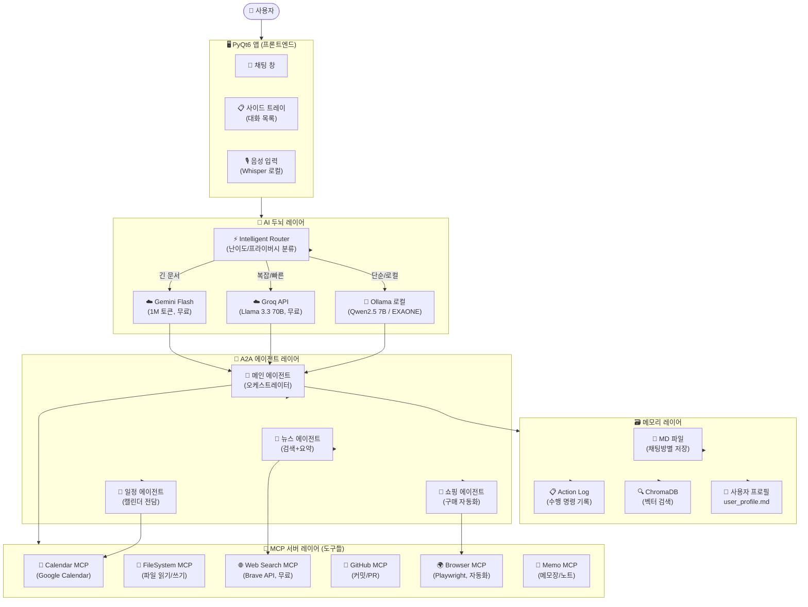
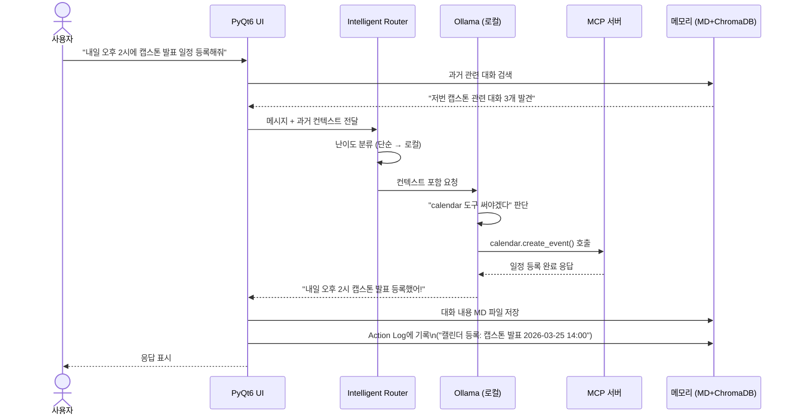
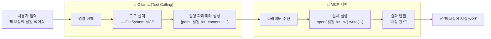
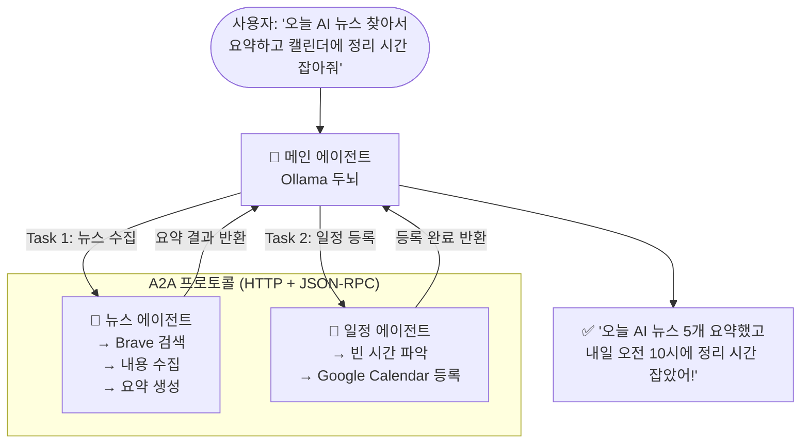
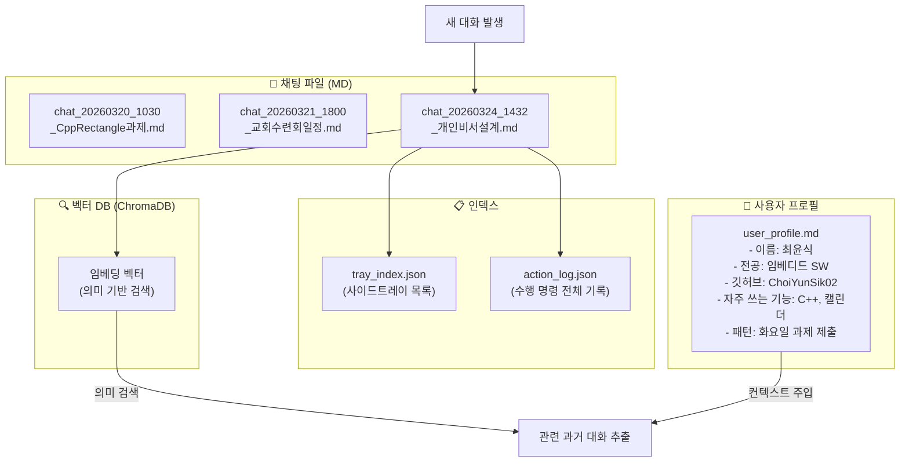
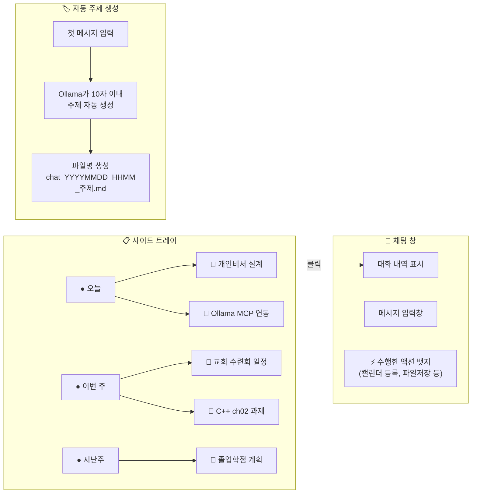
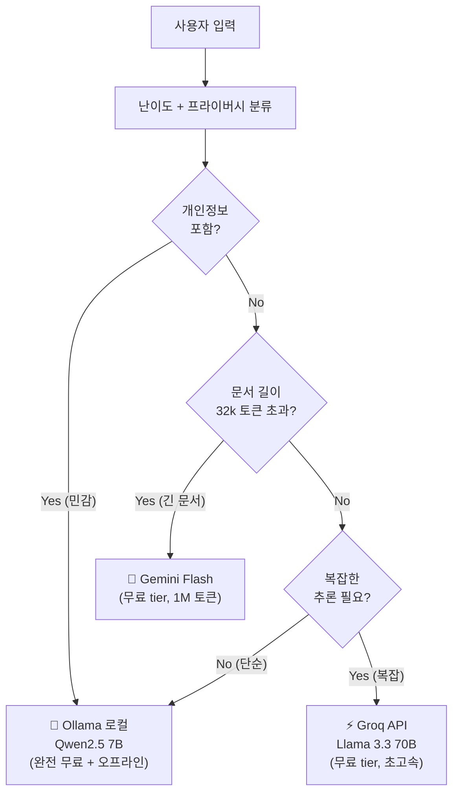
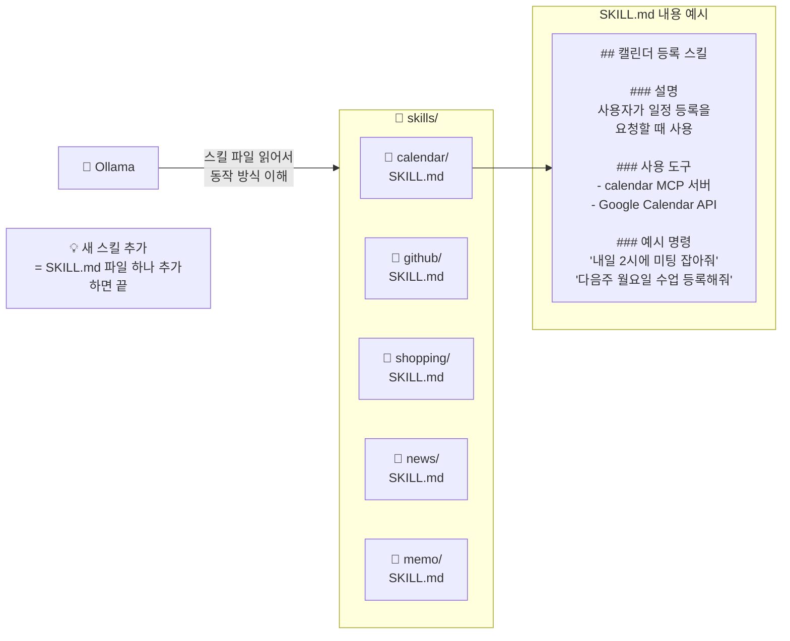
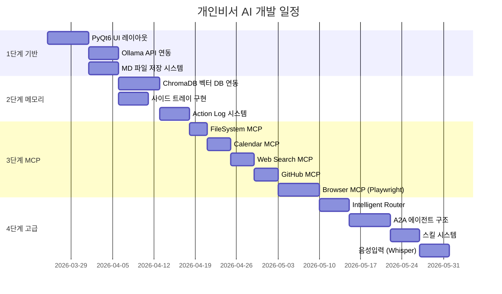
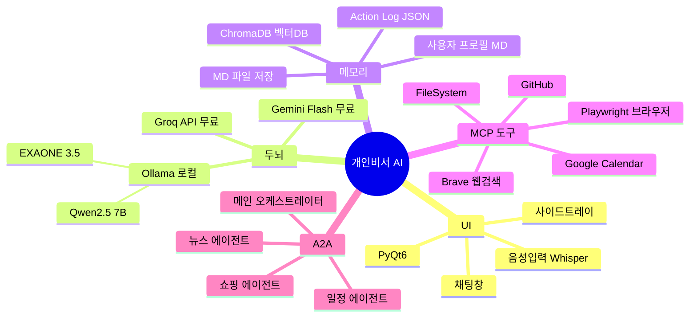

# 🤖 나만의 개인비서 AI - 시스템 아키텍처 & 구현 계획

> 작성자: 2101091 최윤식  
> 작성일: 2026년 03월 24일  
> 목표: Ollama + MCP + A2A 기반 완전 무료 로컬 AI 개인비서

---

## 1. 전체 시스템 개요



---

## 2. 대화 흐름 (Sequence Diagram)



---

## 3. MCP 동작 원리 상세



---

## 4. A2A 에이전트 통신 구조



---

## 5. 메모리 시스템 구조



---

## 6. 사이드 트레이 & 채팅방 구조



---

## 7. Intelligent Router (모델 자동 선택)



---

## 8. 스킬 시스템 (OpenClaw 방식 참고)



---

## 9. 구현 단계별 계획



---

## 10. 기술 스택 최종 확정



---

## 11. 비용 계획

| 컴포넌트 | 도구 | 비용 |
|---|---|---|
| UI 프레임워크 | PyQt6 | **₩0** |
| 로컬 LLM | Ollama + Qwen2.5 7B | **₩0** |
| 클라우드 LLM (보조) | Groq 무료 tier | **₩0** |
| 클라우드 LLM (긴 문서) | Gemini Flash 무료 tier | **₩0** |
| 벡터 DB | ChromaDB | **₩0** |
| 웹 검색 | Brave Search API 무료 2000회/월 | **₩0** |
| 캘린더 | Google Calendar API | **₩0** |
| 브라우저 자동화 | Playwright | **₩0** |
| 음성인식 | Whisper (로컬) | **₩0** |
| **총합** | | **완전 무료 ₩0** |

---

## 12. 폴더 구조

```
📁 personal-ai-assistant/
├── 📁 app/
│   ├── main.py              # PyQt6 앱 진입점
│   ├── ui/
│   │   ├── chat_window.py   # 채팅창
│   │   └── tray_panel.py    # 사이드 트레이
│   ├── brain/
│   │   ├── router.py        # Intelligent Router
│   │   ├── ollama_client.py # Ollama 연동
│   │   └── groq_client.py   # Groq API 연동
│   ├── memory/
│   │   ├── md_manager.py    # MD 파일 관리
│   │   ├── action_log.py    # Action Log
│   │   └── vector_db.py     # ChromaDB
│   ├── mcp/
│   │   ├── calendar_mcp.py  # 캘린더 MCP
│   │   ├── file_mcp.py      # 파일시스템 MCP
│   │   ├── search_mcp.py    # 웹검색 MCP
│   │   ├── github_mcp.py    # GitHub MCP
│   │   └── browser_mcp.py   # 브라우저 MCP
│   └── agents/
│       ├── main_agent.py    # 메인 오케스트레이터
│       ├── news_agent.py    # 뉴스 에이전트
│       ├── schedule_agent.py# 일정 에이전트
│       └── shop_agent.py    # 쇼핑 에이전트
│
├── 📁 memory/
│   ├── 📁 chats/            # 채팅방별 MD 파일
│   ├── 📁 vector_index/     # ChromaDB 인덱스
│   ├── tray_index.json      # 트레이 목록
│   ├── action_log.json      # 전체 액션 기록
│   └── user_profile.md      # 사용자 프로필
│
└── 📁 skills/
    ├── 📁 calendar/SKILL.md
    ├── 📁 github/SKILL.md
    ├── 📁 shopping/SKILL.md
    ├── 📁 news/SKILL.md
    └── 📁 memo/SKILL.md
```

---

> 📌 **핵심 요약**: Ollama는 "두뇌" 역할만 하고, MCP 서버들이 실제 도구로 동작하며, A2A는 에이전트끼리 HTTP로 통신하는 구조. 세 가지 모두 함께 사용 가능하며 비용은 완전 무료.
