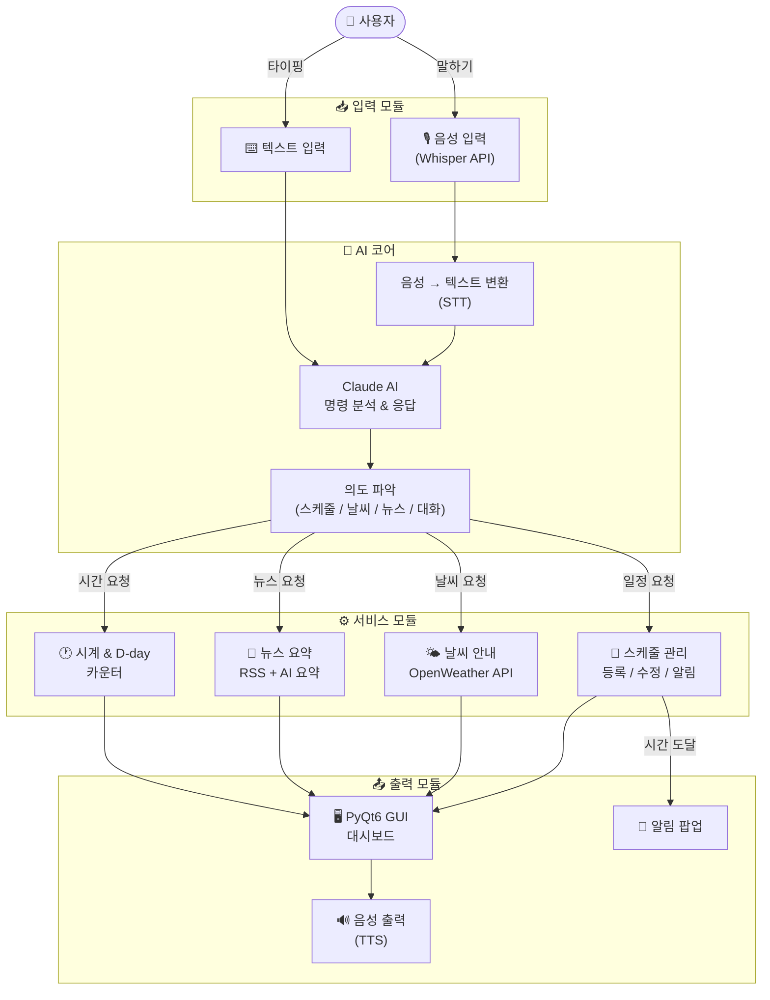
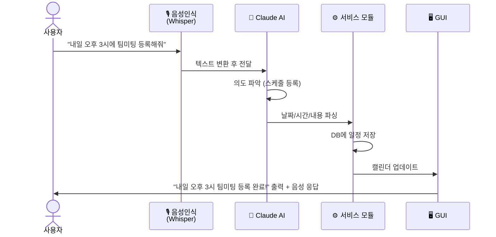
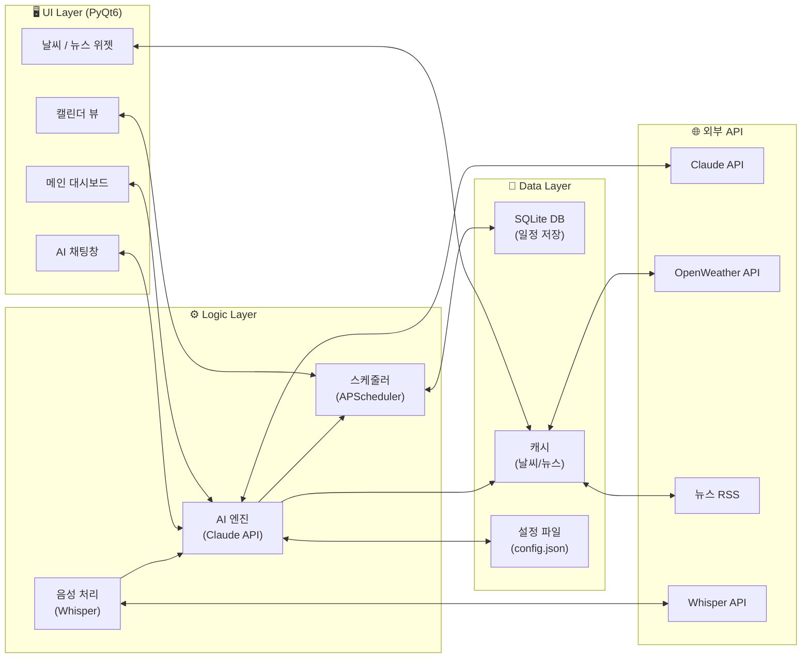
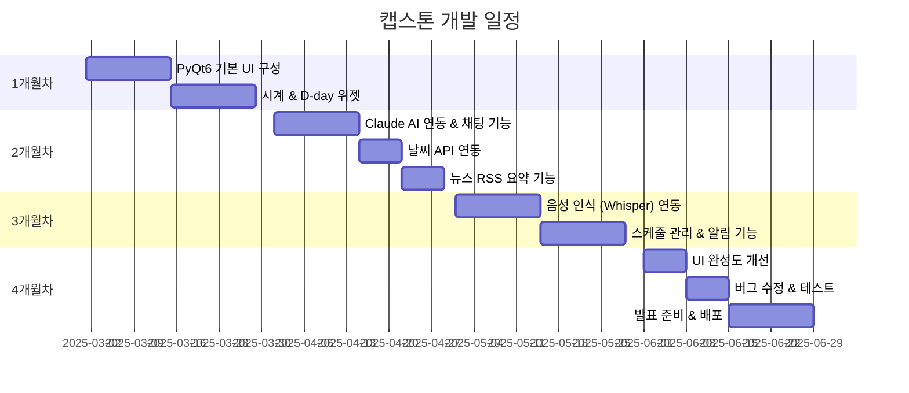

# 🤖 AI 개인 비서 데스크탑 앱

> 음성으로 말하면 AI가 스케줄 관리, 날씨 안내, 뉴스 요약, 알림까지 대신 처리해주는 올인원 데스크탑 비서

---

## 📌 프로젝트 개요

| 항목 | 내용 |
|------|------|
| 프로젝트명 | AI 개인 비서 데스크탑 앱 |
| 개발 언어 | Python 3.10+ |
| GUI 프레임워크 | PyQt6 |
| 개발 기간 | 2025.03 ~ 2025.06 (약 4개월) |
| 개발 인원 | 1인 |

---

## 🎯 제작 목적

스케줄 확인, 날씨 검색, 뉴스 읽기 등 매일 반복되는 작업을 **AI가 대신 처리**해주는 개인 비서 앱. 사용자는 말 한마디만 하면 되고, AI가 알아서 필요한 정보를 찾아 답변하거나 일정을 등록해줍니다.

---

## 🏗️ 전체 시스템 블록도



---

## 🔄 음성 명령 처리 흐름



---

## 🧩 모듈 구성도



---

## 📅 개발 로드맵



---

## 🛠️ 기술 스택

| 분류 | 기술 |
|------|------|
| 언어 | Python 3.10+ |
| GUI | PyQt6 |
| AI 대화 | Claude API |
| 음성 인식 | OpenAI Whisper API |
| 음성 출력 | pyttsx3 (TTS) |
| 날씨 | OpenWeatherMap API |
| 뉴스 | RSS Feed + AI 요약 |
| 스케줄러 | APScheduler |
| DB | SQLite |

---

## 📁 프로젝트 폴더 구조

```
ai-assistant/
├── main.py                  # 앱 진입점
├── config.json              # API 키 & 설정
├── requirements.txt         # 패키지 목록
│
├── ui/                      # PyQt6 UI 파일
│   ├── main_window.py       # 메인 대시보드
│   ├── chat_widget.py       # AI 채팅창
│   ├── calendar_widget.py   # 캘린더
│   └── weather_widget.py    # 날씨 위젯
│
├── core/                    # 핵심 로직
│   ├── ai_engine.py         # Claude API 연동
│   ├── voice.py             # 음성 인식/출력
│   └── scheduler.py        # 스케줄 & 알림
│
├── services/                # 외부 서비스
│   ├── weather.py           # 날씨 API
│   └── news.py              # 뉴스 RSS
│
└── database/
    └── db.py                # SQLite 관리
```

---

## 🔮 향후 확장 아이디어

- [ ] 모바일 앱 연동 (원격 알림)
- [ ] 얼굴 인식으로 자동 로그인
- [ ] 개인 일정 패턴 학습 및 자동 추천
- [ ] 다국어 음성 인식 지원
