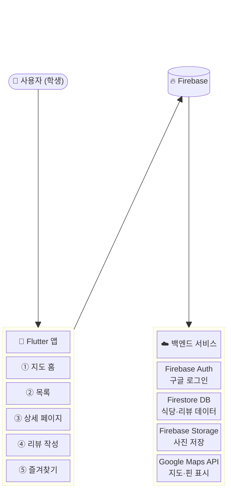
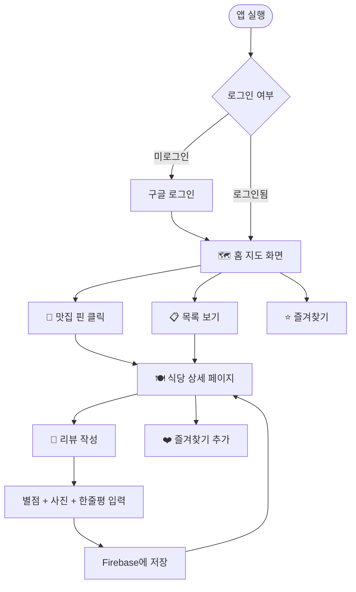
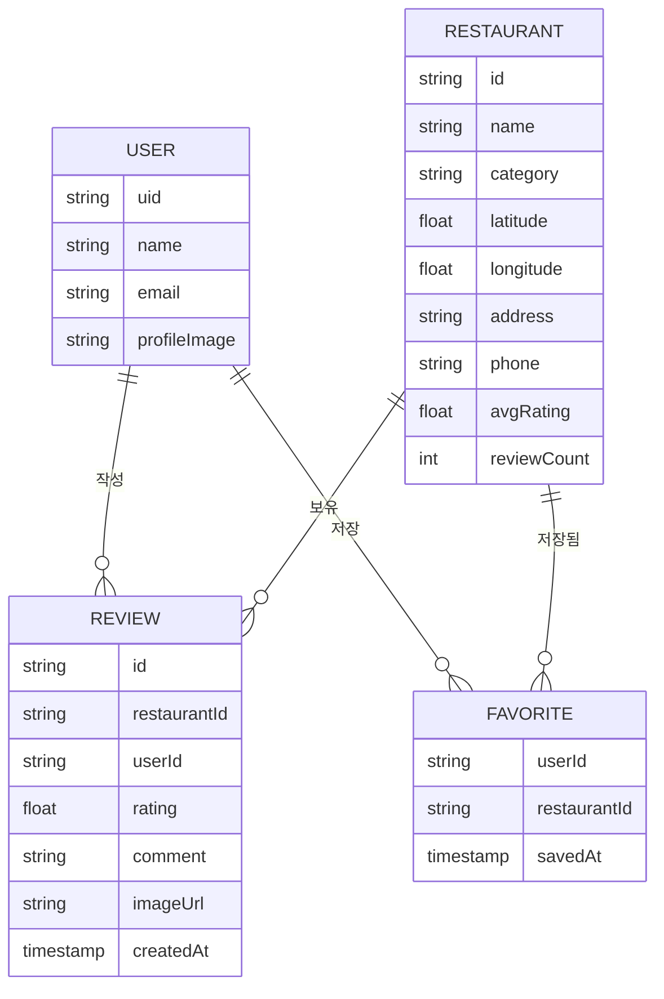
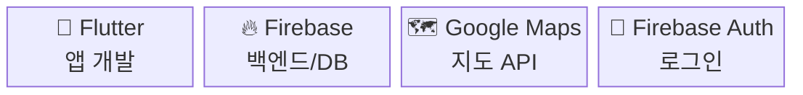
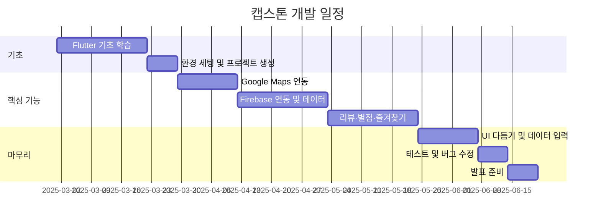

# 🗺️ 캠퍼스 맛집 지도 앱 — 캡스톤 설계 문서

---

## 1. 전체 시스템 구조

---

## 2. 화면 흐름 (User Flow)

---

## 3. 데이터 구조

---

## 4. 기술 스택

---

## 5. 개발 일정 (16주)

---

## 6. 차별화 포인트

| 기능 | 설명 |
|------|------|
| 🕐 혼잡도 표시 | 점심·저녁 시간대별 붐비는 정도 |
| 🏷️ 태그 필터 | `#혼밥가능` `#단체모임` `#가성비` |
| 📸 사진 피드 | 최근 리뷰 사진 인스타 스타일로 모아보기 |
