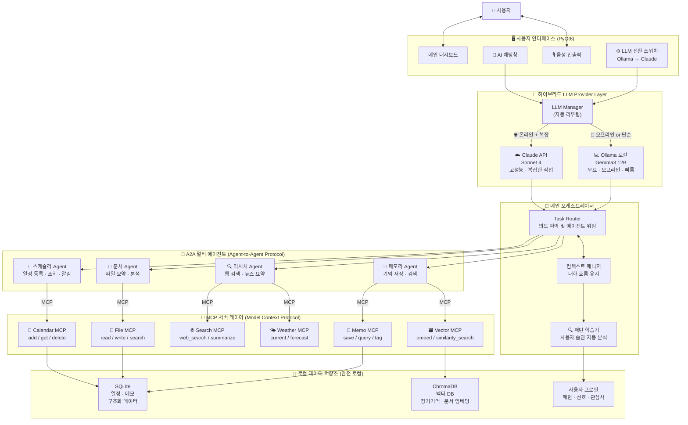
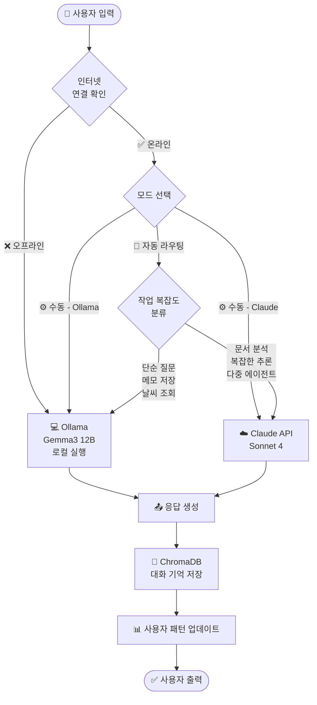
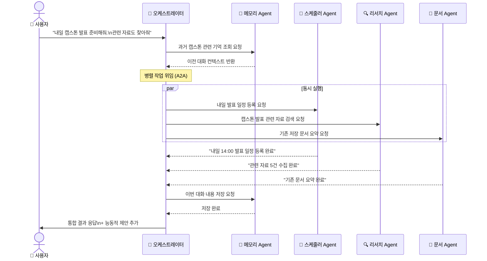
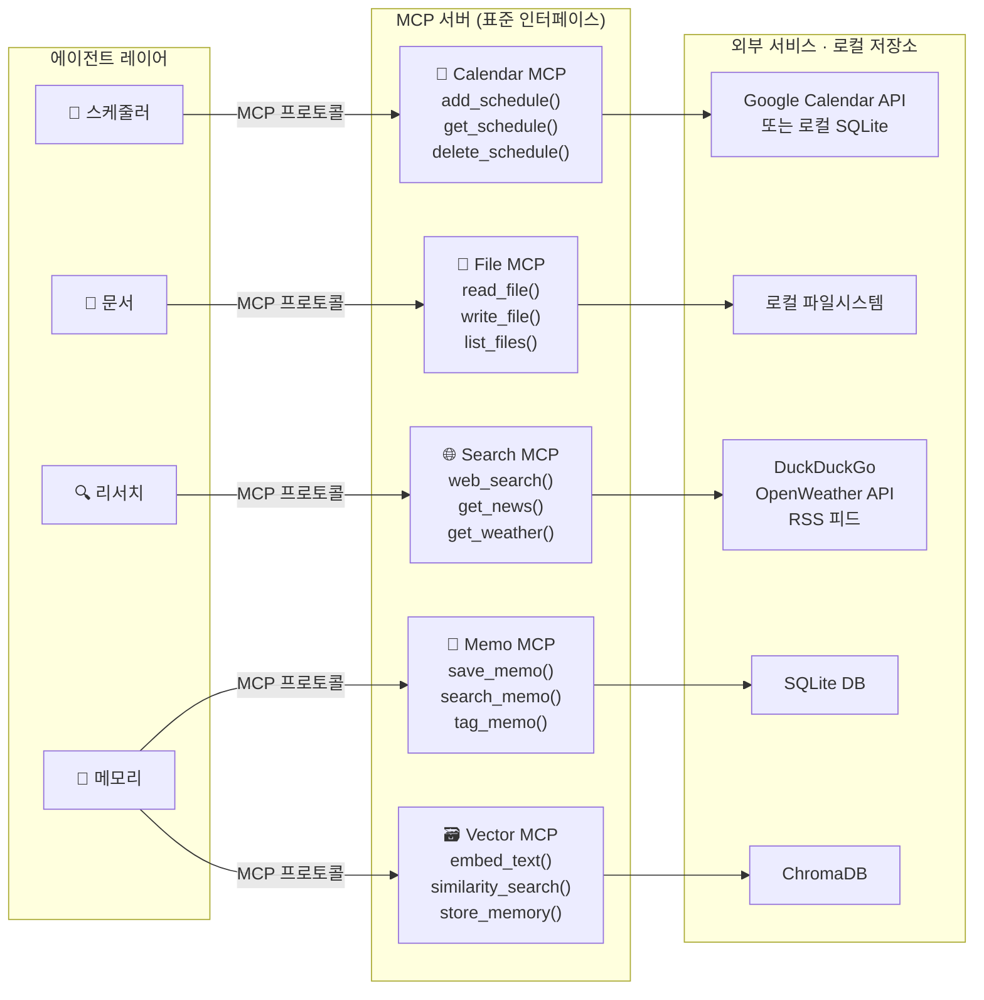
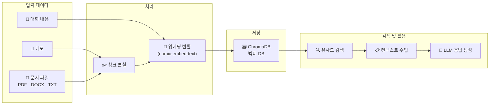
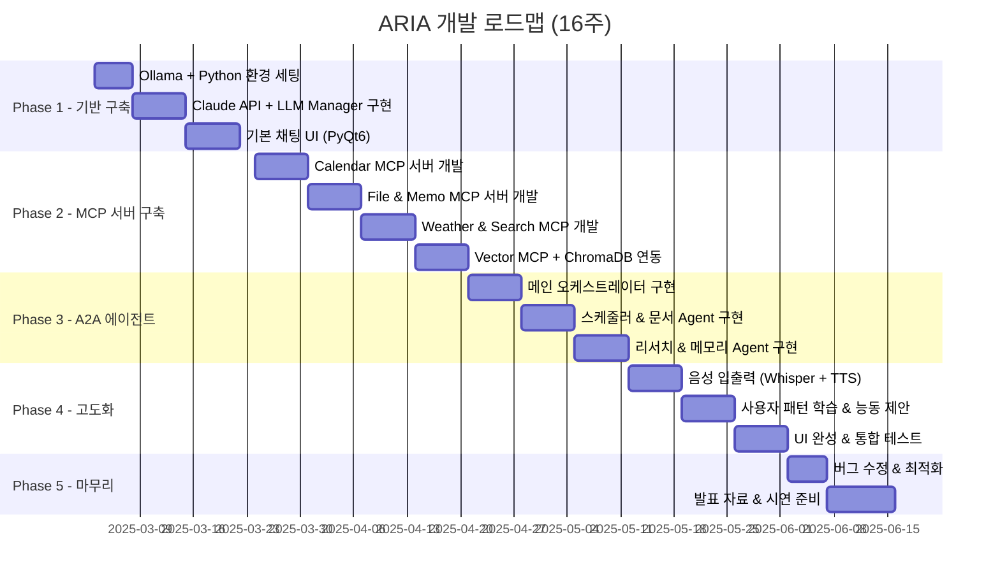

# 🤖 ARIA — Adaptive Reasoning Intelligence Assistant

> **완전 로컬 기반 · 프라이버시 중심 · MCP/A2A 표준 프로토콜 적용**
> 인터넷 없이도 동작하고, 나를 진짜로 기억하는 AI 개인 비서

---

## 📌 프로젝트 개요

| 항목 | 내용 |
|------|------|
| 프로젝트명 | ARIA (Adaptive Reasoning Intelligence Assistant) |
| 개발 언어 | Python 3.10+ |
| GUI 프레임워크 | PyQt6 |
| 개발 기간 | 2025.03 ~ 2025.06 (약 4개월) |
| 개발 인원 | 1인 (캡스톤 디자인) |
| 핵심 프로토콜 | MCP (Model Context Protocol) + A2A (Agent-to-Agent Protocol) |

---

## 🎯 제작 목적 및 차별화 전략

### 기존 AI 비서의 한계

| 문제점 | 기존 서비스 | ARIA |
|---|---|---|
| **개인정보 유출** | 모든 대화가 외부 서버 전송 | 100% 로컬 저장, 외부 전송 없음 |
| **인터넷 의존** | 오프라인 사용 불가 | Ollama 로컬 모델로 완전 오프라인 동작 |
| **기억 부재** | 대화 종료 시 기억 초기화 | ChromaDB 벡터 DB로 영구 장기 기억 |
| **수동적 응답** | 물어봐야만 답변 | 패턴 학습 후 능동적으로 제안 |
| **확장 불가** | 기능 추가 불가 폐쇄 구조 | MCP 플러그인 방식으로 자유롭게 확장 |
| **단일 AI** | 하나의 모델이 모든 것 처리 | A2A 멀티 에이전트 협업 구조 |

### 핵심 차별화 포인트

```
① 하이브리드 LLM  →  Ollama(무료/로컬) + Claude API(고성능) 자동 전환
② MCP 표준 프로토콜  →  도구 추가 시 기존 코드 수정 없이 플러그인 방식 확장
③ A2A 멀티 에이전트  →  전문 에이전트들이 병렬 협업으로 복잡한 작업 처리
④ 장기 기억 (RAG)  →  과거 대화, 메모, 문서를 벡터 DB에 저장해 영구 기억
⑤ 능동적 비서  →  사용자 패턴 학습 후 먼저 제안하고 의견을 제시
```

---

## 🏗️ 전체 시스템 블록도



---

## 🧠 하이브리드 LLM 자동 라우팅 흐름



---

## 🤝 A2A 에이전트 협업 흐름



---

## 🔌 MCP 서버 구조



> **MCP의 핵심 장점**: 새 기능 추가 시 기존 코드 수정 없이 MCP 서버만 추가하면 됨
> → 향후 Slack MCP, 이메일 MCP, GitHub MCP 등 무제한 확장 가능

---

## 🧠 장기 기억 (RAG) 구조



> **"저번에 말한 캡스톤 주제가 뭐였지?"** → 몇 주 전 대화도 정확히 기억해서 답변

---

## 📅 개발 로드맵



---

## 🛠️ 기술 스택

| 분류 | 기술 | 선택 이유 |
|---|---|---|
| **LLM (로컬)** | Ollama + Gemma3 12B | 오프라인 동작, 빠른 응답, 자연스러운 말투 |
| **LLM (클라우드)** | Claude API (Sonnet 4) | MCP 네이티브 지원, 최고 수준 한국어 |
| **MCP** | Python MCP SDK | Anthropic 공식 표준 프로토콜 |
| **A2A** | Google A2A SDK | 멀티 에이전트 표준 프로토콜 |
| **GUI** | PyQt6 | 데스크탑 앱 배포, 풍부한 위젯 |
| **음성 인식** | OpenAI Whisper (로컬) | 한국어 인식률 최상, 오프라인 동작 |
| **음성 합성** | pyttsx3 / Coqui TTS | 완전 로컬, 빠른 응답 |
| **벡터 DB** | ChromaDB | 완전 로컬, 설치 간단, 장기 기억 |
| **관계형 DB** | SQLite | 경량 로컬 DB, 일정·메모 저장 |
| **스케줄러** | APScheduler | 알림, 백그라운드 작업 |
| **임베딩** | nomic-embed-text | Ollama 지원, 로컬 실행 |
| **웹 검색** | DuckDuckGo Search | 무료, API 키 불필요 |
| **날씨** | OpenWeatherMap API | 무료 플랜 제공 |
| **뉴스** | RSS Feed + AI 요약 | 실시간 뉴스, 비용 없음 |

---

## 📁 프로젝트 폴더 구조

```
ARIA/
├── main.py                      # 앱 진입점
├── config.py                    # API 키 & 설정 (env 기반)
├── requirements.txt
│
├── core/                        # 핵심 엔진
│   ├── llm_manager.py           # 하이브리드 LLM 관리 & 자동 라우팅
│   ├── orchestrator.py          # 메인 오케스트레이터 (A2A 위임)
│   ├── context_manager.py       # 대화 컨텍스트 유지
│   └── profile_learner.py       # 사용자 패턴 학습
│
├── agents/                      # A2A 에이전트들
│   ├── base_agent.py            # 공통 베이스 클래스
│   ├── scheduler_agent.py       # 일정 관리 에이전트
│   ├── document_agent.py        # 문서 처리 에이전트
│   ├── research_agent.py        # 리서치 에이전트
│   └── memory_agent.py          # 기억 관리 에이전트
│
├── mcp_servers/                 # MCP 서버들
│   ├── calendar_mcp.py          # 캘린더 MCP
│   ├── file_mcp.py              # 파일시스템 MCP
│   ├── search_mcp.py            # 웹 검색 MCP
│   ├── memo_mcp.py              # 메모 MCP
│   ├── vector_mcp.py            # 벡터 DB MCP
│   └── weather_mcp.py           # 날씨 MCP
│
├── memory/
│   ├── vector_store.py          # ChromaDB 관리
│   ├── embedder.py              # 텍스트 임베딩
│   └── retriever.py             # 유사도 검색
│
├── voice/
│   ├── stt.py                   # 음성 인식 (Whisper 로컬)
│   └── tts.py                   # 음성 합성
│
├── ui/                          # PyQt6 UI
│   ├── main_window.py           # 메인 대시보드
│   ├── chat_widget.py           # AI 채팅창
│   ├── calendar_widget.py       # 캘린더 뷰
│   ├── weather_widget.py        # 날씨 위젯
│   ├── news_widget.py           # 뉴스 위젯
│   └── model_toggle.py          # LLM 전환 스위치
│
├── services/                    # 외부 서비스 연동
│   ├── weather.py               # OpenWeather API
│   ├── news.py                  # RSS 뉴스 수집
│   └── web_search.py            # DuckDuckGo 검색
│
├── data/                        # 로컬 데이터 (gitignore)
│   ├── chroma_db/               # 벡터 DB
│   ├── aria.db                  # SQLite DB
│   └── user_profile.json        # 사용자 패턴 프로필
│
└── tests/
    ├── test_llm_manager.py
    ├── test_agents.py
    └── test_mcp_servers.py
```

---

## ✨ 핵심 기능 명세

### 💬 자연어 대화
- 한국어/영어 혼용 자연스러운 대화
- AI스럽지 않은 친근한 말투 (페르소나 설계)
- 이전 대화 맥락 유지 및 연속 대화

### 📅 일정 관리
- "내일 오후 3시 팀미팅 등록해줘" → 자동 캘린더 등록
- 오늘/이번 주 일정 조회
- 일정 30분 전 자동 알림 팝업

### 🧠 장기 기억
- 과거 대화, 메모, 문서를 ChromaDB에 영구 저장
- "저번에 말한 캡스톤 주제가 뭐였지?" → 정확히 기억

### 📄 문서 요약
- PDF, DOCX, TXT 업로드 → 핵심 요약
- 논문 분석: 목적/방법/결론 구조화 추출

### 🌤️ 날씨 & 📰 뉴스
- 실시간 날씨 조회 및 예보
- RSS 뉴스 수집 후 AI가 핵심만 요약

### 💡 능동적 제안
- 사용자 패턴 학습 후 먼저 제안
- "내일 발표 있는데, 오늘 준비 시작할까요?"

### 🎙️ 음성 인터페이스
- 한국어 음성 명령 인식 (Whisper 로컬)
- 자연스러운 한국어 음성 응답 (TTS)

---

## 🔮 향후 확장 계획

- [ ] Slack MCP 서버 추가 (메시지 전송/조회)
- [ ] 이메일 MCP 서버 추가
- [ ] GitHub MCP 서버 추가 (이슈/PR 관리)
- [ ] 모바일 앱 연동 (원격 알림)
- [ ] 사용자별 파인튜닝 모델 적용
- [ ] 다중 사용자 지원

---

## 🖥️ 개발 환경

```
OS        : Windows 11
CPU       : AMD Ryzen 9 7945HX (16 Core / 32 Thread)
RAM       : 32GB DDR5
GPU       : NVIDIA RTX 4070 Laptop (8GB VRAM)
SSD       : Samsung 980 Pro 2TB (NVMe)
Python    : 3.11+
CUDA      : 12.x
```

---

## 🎓 캡스톤 디자인 어필 포인트

> *"단순한 Claude API 래퍼가 아닙니다.*
> *MCP · A2A 최신 표준 프로토콜을 적용한 확장 가능한 구조,*
> *오프라인에서도 동작하는 하이브리드 LLM,*
> *ChromaDB 기반 장기 기억으로 진짜 나를 아는 비서를 구현했습니다."*

---

*본 프로젝트는 캡스톤 디자인 수업 1인 프로젝트로 개발되었습니다.*
