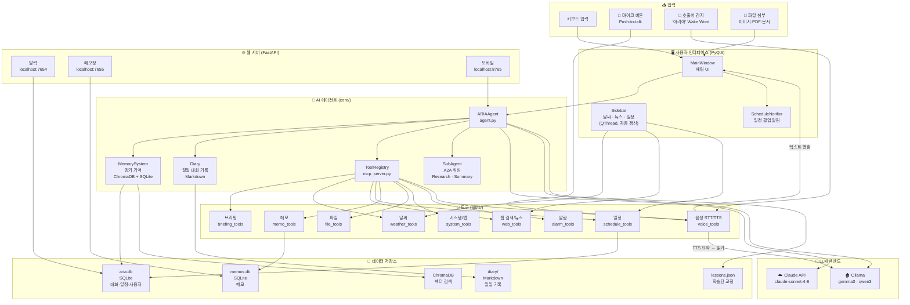
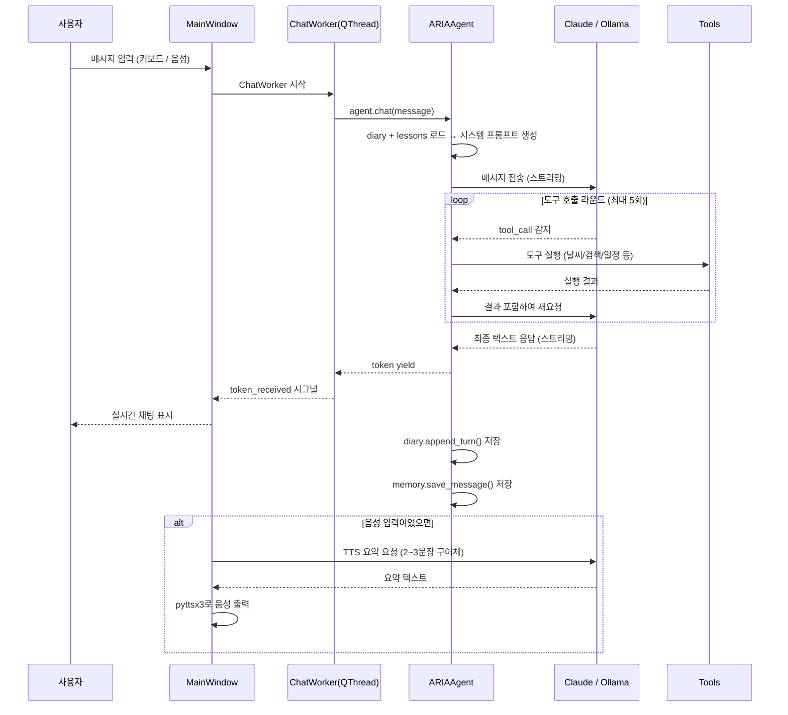
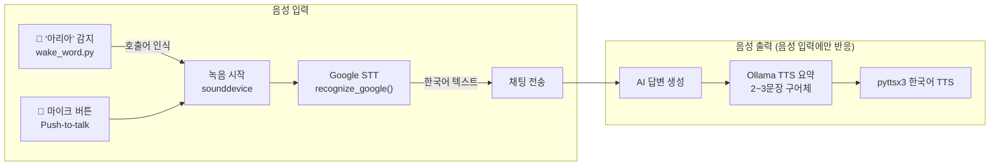
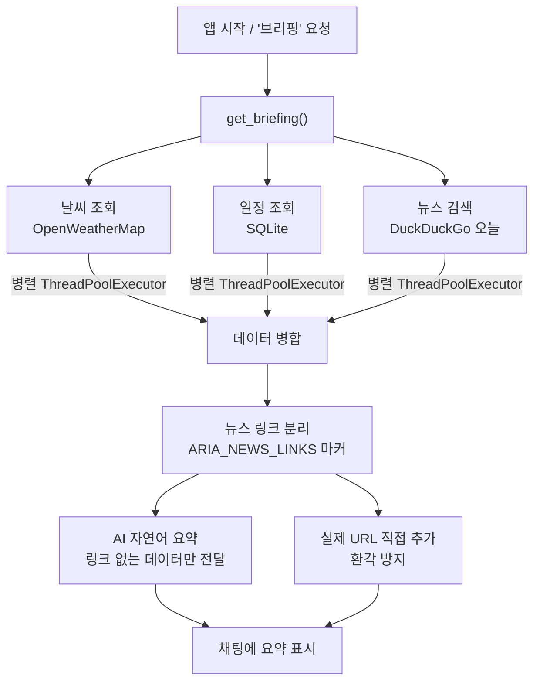

# ARIA — Adaptive Reasoning Intelligence Assistant

> Windows 환경에서 실행되는 한국어 최적화 AI 개인 비서
> Claude API 또는 Ollama(로컬 LLM) 기반 · PyQt6 데스크탑 앱

---

## 소개

ARIA는 개인 PC에서 완전히 로컬로 동작하는 AI 비서입니다.
클라우드 서버 없이도 Ollama를 통해 오프라인으로 사용할 수 있으며, Claude API를 연결하면 더 높은 품질의 응답을 받을 수 있습니다.

**핵심 설계 원칙**

- **프라이버시 우선** — 모든 대화·일정·메모는 로컬 SQLite에만 저장됩니다
- **도구 기반 추론** — AI가 직접 날씨·검색·파일·앱을 제어합니다 (MCP 패턴)
- **한국어 최적화** — 시스템 프롬프트, 음성 인식, TTS 모두 한국어 기준
- **멀티모달** — 텍스트·음성·이미지·문서를 하나의 인터페이스에서 처리

---

## 목차

1. [주요 기능](#주요-기능)
2. [시스템 구성도](#시스템-구성도)
3. [아키텍처 상세](#아키텍처-상세)
4. [설치 및 실행](#설치-및-실행)
5. [환경 변수 설정](#환경-변수-설정)
6. [사용 예시](#사용-예시)
7. [커스터마이징](#커스터마이징)
8. [도구 목록](#도구-목록)
9. [디렉토리 구조](#디렉토리-구조)
10. [트러블슈팅 / FAQ](#트러블슈팅--faq)
11. [개발 참고](#개발-참고)
12. [라이선스](#라이선스)

---

## 주요 기능

| 기능 | 설명 |
|------|------|
| **AI 채팅** | Claude API / Ollama 전환 지원, 스트리밍 응답 |
| **오늘 브리핑** | 앱 시작 시 날씨 + 일정 + 뉴스 자동 요약 |
| **날씨 조회** | IP 자동 위치 감지, 미세먼지(PM2.5/PM10), 3일 예보 |
| **실시간 뉴스** | DuckDuckGo 오늘 뉴스, 클릭 가능한 링크 표시 |
| **일정 관리** | 자연어 일정 추가/조회/삭제, 팝업 알림 |
| **메모장** | AI 자동 저장, 태그 검색, 웹 UI |
| **달력** | 월별 일정 웹 대시보드 (localhost:7654) |
| **파일 관리** | 파일 읽기/생성/삭제/이동/검색 |
| **앱 실행** | 브라우저, 탐색기, 시스템 앱 자동 실행 |
| **음성 입력(STT)** | 마이크 버튼(Push-to-talk) + 호출어 "아리아" |
| **음성 출력(TTS)** | 음성 명령에만 자동 응답, Ollama 구어체 요약 후 읽기 |
| **모바일 접속** | 같은 WiFi에서 스마트폰으로 채팅 (localhost:8765) |
| **첨부파일** | 이미지, PDF, 문서, 코드 파일 분석 |
| **장기 기억** | ChromaDB 벡터 검색 + SQLite 대화 이력 |
| **일일 다이어리** | 대화 자동 Markdown 기록, 다음날 문맥 참고 |
| **서브에이전트** | 복합 리서치·요약 작업을 별도 AI에 위임 (A2A) |

---

## 시스템 구성도



---

## 아키텍처 상세

### AI 에이전트 처리 흐름



### 음성 I/O 흐름



### 브리핑 흐름



---

## 설치 및 실행

### 요구사항

- Python 3.11+
- Windows 10/11
- Ollama (로컬 모드 사용 시) 또는 Claude API 키
- 마이크 (음성 기능 사용 시)

### 설치

```bash
git clone https://github.com/your/ARIA.git
cd ARIA

python -m venv venv
venv\Scripts\activate

pip install -r requirements.txt
```

### 실행

```bash
# 더블클릭
run.bat

# 또는 터미널에서
python main.py
```

### Ollama 모델 설치 (로컬 모드)

```bash
ollama pull gemma3:12b   # 기본 권장 모델 (~8GB VRAM)
ollama pull qwen3:8b     # 경량 대안 (~5GB VRAM)
```

---

## 환경 변수 설정

프로젝트 루트에 `.env` 파일을 생성하세요:

```env
# ── AI 모드 ──────────────────────────────────
# claude | ollama | auto
LLM_MODE=ollama

# ── Claude API (LLM_MODE=claude 시 필수) ─────
CLAUDE_API_KEY=sk-ant-...

# ── Ollama 설정 ───────────────────────────────
OLLAMA_BASE_URL=http://localhost:11434
OLLAMA_MODEL=gemma3:12b
# 모델 VRAM 유지 시간 (0 = 즉시 해제, -1 = 영구 유지)
OLLAMA_KEEP_ALIVE=10m

# ── 날씨 API (없으면 기본 키 사용) ───────────
OPENWEATHER_API_KEY=your_key_here
```

---

## 사용 예시

### 텍스트 입력

```
사용자: 오늘 날씨 어때?
ARIA:   지금 서울은 맑고 기온은 18도예요. 미세먼지는 보통 수준이고,
        오후엔 구름이 조금 낄 것 같아요.

사용자: 내일 오후 3시에 팀 미팅 일정 추가해줘
ARIA:   내일(4월 1일) 오후 3시에 "팀 미팅" 일정을 추가했어요.

사용자: 파이썬으로 피보나치 함수 만들어줘
ARIA:   (코드 직접 채팅에 출력 — 파일 저장은 명시적으로 요청할 때만)

사용자: 이번 주 뉴스 검색해줘
ARIA:   (DuckDuckGo 검색 후 오늘 기준 주요 뉴스 5건 + 클릭 가능한 링크 표시)
```

### 음성 입력 (마이크 버튼 / 호출어)

```
[마이크 버튼 클릭 또는 "아리아" 호출]

사용자: (음성) 오늘 브리핑해줘
ARIA:   (채팅: 전체 브리핑 텍스트 표시)
        (TTS: "오늘 서울 날씨는 맑고 18도예요. 오늘 일정은 오후 3시 팀 미팅이 있어요.")

사용자: (음성) 유튜브에서 재즈 틀어줘
ARIA:   (브라우저에서 YouTube 자동 재생)
        (TTS: "재즈 음악 재생할게요.")
```

### 파일 첨부

```
사용자: [이미지 첨부] 이 사진에서 뭐가 보여?
사용자: [PDF 첨부]  이 문서 요약해줘
사용자: [.py 첨부]  이 코드 리뷰해줘
```

### 모바일 접속

같은 WiFi에 연결된 스마트폰 브라우저에서:
```
http://{PC의 로컬 IP}:8765
```
ARIA 시작 시 터미널에 접속 주소가 출력됩니다.

---

## 커스터마이징

### AI 모델 변경

`config.py` 또는 `.env`에서 설정:

```env
# 더 가벼운 모델 (속도 우선)
OLLAMA_MODEL=qwen3:8b

# 더 정확한 모델 (품질 우선, VRAM 많이 필요)
OLLAMA_MODEL=gemma3:27b
```

### 시스템 프롬프트 커스터마이징

`config.py`의 `get_system_prompt()` 함수에서 AI 성격, 응답 스타일, 도구 사용 규칙을 수정할 수 있습니다.

```python
# config.py 예시 — 사용자 이름 고정
base = f"""
당신은 {사용자이름}의 개인 비서 ARIA입니다.
...
"""
```

### 호출어 변경

`tools/wake_word.py`에서 감지 단어를 수정:

```python
WAKE_WORDS = {"아리아", "aria", "자비스", "헤이 아리아"}
```

### TTS 속도/목소리 변경

`tools/voice_tools.py`의 `_get_tts()` 함수에서:

```python
_tts_engine.setProperty("rate", 175)   # 속도 (기본 175, 높을수록 빠름)
_tts_engine.setProperty("volume", 0.9) # 볼륨 (0.0 ~ 1.0)
```

### 사이드바 갱신 주기 변경

`ui/sidebar_agents.py`에서:

```python
class WeatherAgent(QThread):
    INTERVAL = 600   # 초 단위, 기본 10분

class NewsAgent(QThread):
    INTERVAL = 300   # 기본 5분

class ScheduleAgent(QThread):
    INTERVAL = 30    # 기본 30초
```

### 새 도구 추가

1. `tools/my_tool.py` 생성:

```python
MY_TOOLS = [{
    "name": "my_tool",
    "description": "도구 설명",
    "input_schema": {
        "type": "object",
        "properties": {
            "param": {"type": "string", "description": "파라미터 설명"}
        },
        "required": ["param"]
    }
}]

TOOL_FUNCTIONS = {
    "my_tool": lambda param: f"결과: {param}"
}
```

2. `core/agent.py`에 등록:

```python
from tools.my_tool import MY_TOOLS, TOOL_FUNCTIONS as MY_FN

ALL_TOOLS = (...기존..., *MY_TOOLS)
ALL_FUNCTIONS = {...기존..., **MY_FN}
```

---

## 도구 목록

| 도구 | 함수 | 설명 |
|------|------|------|
| 브리핑 | `get_briefing` | 날씨 + 일정 + 뉴스 한번에 요약 |
| 날씨 | `get_current_weather` | 현재 날씨, 미세먼지, 체감온도 |
| 날씨 예보 | `get_weather_forecast` | 시간별 3일 예보 |
| 웹 검색 | `web_search` | DuckDuckGo 검색 |
| 뉴스 | `web_news` | 오늘 최신 뉴스 (d→w→없음 폴백) |
| 유튜브 | `play_youtube` | 검색 후 브라우저 자동 재생 |
| 일정 추가 | `add_schedule` | 자연어 날짜 파싱 ("내일 3시") |
| 일정 조회 | `get_today_schedule` / `list_schedules` | 오늘/N일 일정 |
| 메모 저장 | `save_memo` | 제목 + 내용 + 태그 저장 |
| 메모 검색 | `search_memos` | 제목/내용/태그 검색 |
| 파일 읽기 | `read_file` | 텍스트 파일 내용 읽기 |
| 파일 생성 | `write_file` | 파일 생성/덮어쓰기 |
| 파일 검색 | `search_files` | 정규식 파일 검색 |
| 앱 실행 | `open_application` | 브라우저, 탐색기, 메모장 등 |
| 클립보드 | `set_clipboard` / `get_clipboard` | 클립보드 읽기/쓰기 |
| 시스템 정보 | `get_system_info` | CPU, RAM, 디스크 |
| 알람 | `set_alarm` | 팝업 + 소리 알람 설정 |
| 리서치 | `research_with_agent` | SubAgent에 웹 리서치 위임 |

---

## 디렉토리 구조

```
ARIA/
├── main.py                  # 앱 진입점
├── config.py                # 설정 + 동적 시스템 프롬프트
├── requirements.txt
├── run.bat                  # Windows 실행 스크립트
├── .env                     # 환경 변수 (gitignore)
│
├── core/
│   ├── agent.py             # Claude/Ollama 통합 에이전트
│   ├── memory.py            # 장기 기억 (ChromaDB + SQLite)
│   ├── diary.py             # 일일 대화 기록 (Markdown)
│   ├── mcp_server.py        # 도구 레지스트리
│   └── a2a.py               # SubAgent 프레임워크
│
├── tools/
│   ├── briefing_tools.py    # 오늘 브리핑
│   ├── weather_tools.py     # 날씨 + 미세먼지
│   ├── web_tools.py         # 웹 검색 · 뉴스 · YouTube
│   ├── schedule_tools.py    # 일정 CRUD
│   ├── memo_tools.py        # 메모 CRUD
│   ├── file_tools.py        # 파일 관리
│   ├── system_tools.py      # 앱 실행 · 클립보드 · 시스템
│   ├── alarm_tools.py       # 알람 설정
│   ├── agent_tools.py       # SubAgent 호출
│   ├── voice_tools.py       # STT (Google) + TTS (pyttsx3)
│   ├── wake_word.py         # 호출어 감지 ("아리아")
│   ├── attachment_tools.py  # 첨부파일 처리
│   ├── calendar_server.py   # 달력 웹 서버 (:7654)
│   └── memo_server.py       # 메모장 웹 서버 (:7655)
│
├── ui/
│   ├── main_window.py       # 메인 채팅 UI (PyQt6)
│   ├── sidebar_agents.py    # 자동 갱신 사이드바
│   └── schedule_notifier.py # 일정 팝업 알림
│
├── services/
│   └── mobile_server.py     # 모바일 웹 서버 (:8765)
│
└── data/                    # 로컬 데이터 (자동 생성)
    ├── aria.db              # 대화 · 일정 (SQLite)
    ├── memos.db             # 메모 (SQLite)
    ├── alarms.json          # 알람 설정
    ├── lessons.json         # 학습된 교정 사항
    ├── chroma/              # 벡터 저장소
    └── diary/               # 일일 대화 Markdown
```

---

## 트러블슈팅 / FAQ

### Ollama 연결 오류

```
❌ Ollama 오류: ... Ollama가 실행 중인지 확인해주세요
```

- Ollama 앱이 실행 중인지 확인: `http://localhost:11434`
- 모델이 설치돼 있는지 확인: `ollama list`
- `.env`의 `OLLAMA_MODEL` 값이 설치된 모델명과 일치하는지 확인

---

### 음성 인식이 안 돼요

- 마이크 권한이 허용돼 있는지 확인 (Windows 설정 → 개인 정보 → 마이크)
- 인터넷 연결 필요 — Google STT는 온라인 서비스입니다
- `sounddevice`, `SpeechRecognition` 패키지가 설치됐는지 확인:
  ```bash
  pip install sounddevice SpeechRecognition
  ```

---

### TTS가 소리가 안 나요

- Windows 기본 한국어 TTS 음성이 설치돼 있어야 합니다
- 설정 → 시간 및 언어 → 음성 → 음성 추가에서 한국어 음성 설치
- `pyttsx3` 패키지 재설치:
  ```bash
  pip uninstall pyttsx3 && pip install pyttsx3
  ```

---

### 날씨가 안 나와요

- OpenWeatherMap API 키 확인 (`.env`의 `OPENWEATHER_API_KEY`)
- IP 위치 감지 실패 시 수동으로 도시 지정:
  ```
  사용자: 서울 날씨 알려줘
  ```

---

### 브리핑이 자동 실행 안 돼요

- 앱 시작 후 1.5초 뒤 자동 실행됩니다 (Ollama 초기화 대기)
- Ollama 모델 로딩이 느리면 더 걸릴 수 있습니다
- 수동으로 "오늘 브리핑해줘"라고 입력하면 강제 실행됩니다

---

### 메모리/VRAM 부족

- 경량 모델로 교체: `.env`에서 `OLLAMA_MODEL=qwen3:8b`
- 응답 후 VRAM 자동 해제 시간 단축: `OLLAMA_KEEP_ALIVE=2m`
- 즉시 해제: UI 상단 "모델 해제" 버튼 클릭

---

### ChromaDB 오류 (첫 실행 시)

```bash
# data/chroma 폴더 삭제 후 재시작
rmdir /s /q data\chroma
python main.py
```

---

## 개발 참고

### 주요 클래스 및 진입점

| 파일 | 클래스/함수 | 역할 |
|------|------------|------|
| `core/agent.py` | `ARIAAgent.chat()` | AI 응답 생성 (Generator) |
| `core/agent.py` | `ARIAAgent._chat_ollama_native()` | Ollama native tool calling |
| `core/agent.py` | `ARIAAgent._chat_claude()` | Claude API tool_use |
| `core/memory.py` | `MemorySystem` | ChromaDB + SQLite 기억 |
| `core/diary.py` | `append_turn()` / `get_today_context()` | 일일 대화 기록 |
| `core/mcp_server.py` | `ToolRegistry.execute()` | 도구 실행 엔트리포인트 |
| `ui/main_window.py` | `ChatWorker` | 비동기 AI 응답 스레드 |
| `ui/sidebar_agents.py` | `WeatherAgent` / `NewsAgent` | 자동 갱신 QThread |

### AI 모드 전환 로직

```python
# config.py
LLM_MODE = "ollama"   # claude | ollama | auto

# agent.py — 자동 감지
def _detect_mode(self) -> str:
    if LLM_MODE == "claude" and CLAUDE_API_KEY:
        return "claude"
    if LLM_MODE == "ollama":
        return "ollama"
    if CLAUDE_API_KEY:        # auto: Claude 키 있으면 Claude
        return "claude"
    return "ollama"           # auto: 없으면 Ollama
```

### 도구 등록 패턴

모든 도구는 Claude API 형식(`input_schema`)으로 정의하고, `ToolRegistry`가 Ollama 형식으로 자동 변환합니다:

```python
# tools/my_tool.py
MY_TOOLS = [{
    "name": "my_tool",
    "description": "...",
    "input_schema": {
        "type": "object",
        "properties": {...},
        "required": [...]
    }
}]
TOOL_FUNCTIONS = {"my_tool": my_function}
```

### 스트리밍 응답 구조

```python
# ChatWorker (QThread) → MainWindow 시그널
class ChatWorker(QThread):
    token_received = pyqtSignal(str)  # 토큰 단위 스트리밍
    finished = pyqtSignal()
    error = pyqtSignal(str)

    def run(self):
        for token in self.agent.chat(self.message):
            self.token_received.emit(token)
        self.finished.emit()
```

### 웹 API 엔드포인트 (모바일 서버)

| 메서드 | 경로 | 설명 |
|--------|------|------|
| `GET` | `/` | 모바일 채팅 웹 UI |
| `POST` | `/api/chat` | 채팅 (JSON: `{"message": "..."}`) |
| `GET` | `/api/schedules` | 오늘 일정 목록 |
| `POST` | `/api/schedule` | 일정 추가 |
| `GET` | `/api/weather` | 현재 날씨 |

---

## 기술 스택

| 영역 | 기술 |
|------|------|
| GUI | PyQt6 |
| AI (클라우드) | Anthropic Claude API (claude-sonnet-4-6) |
| AI (로컬) | Ollama (gemma3, qwen3) |
| 음성 인식 | SpeechRecognition + Google STT |
| 음성 합성 | pyttsx3 |
| 벡터 DB | ChromaDB |
| 관계형 DB | SQLite |
| 웹 서버 | FastAPI + uvicorn |
| 웹 검색 | duckduckgo-search |
| 날씨 | OpenWeatherMap API |
| YouTube | yt-dlp |

---

## 라이선스

이 프로젝트는 개인 학습 및 비상업적 사용을 위해 제작되었습니다.

- **Anthropic Claude API** — [Anthropic 이용약관](https://www.anthropic.com/legal/aup) 준수
- **Ollama** — MIT License
- **OpenWeatherMap** — Free tier 사용 (비상업적)
- **DuckDuckGo Search** — 비상업적 개인 사용

---

*ARIA — 로컬에서 돌아가는 나만의 AI 비서*
